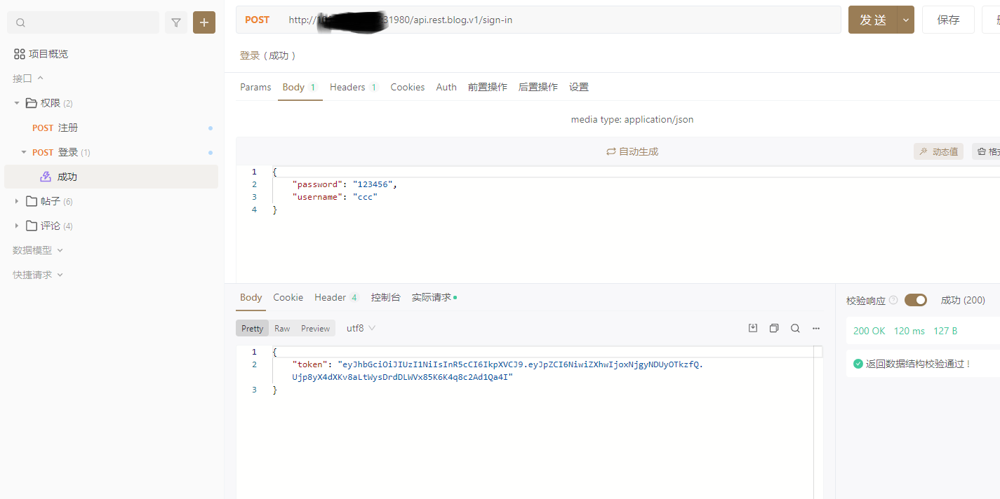

# gz-blog-microsevices

基于 [go-zero](https://github.com/zeromicro/go-zero)+[gorm](https://github.com/go-gorm/gorm)+ddd 的博客微服务 demo，支持分布式事务。参考
[blog-microservices ](https://github.com/jxlwqq/blog-microservices)(istio+go-kratos)

## 1.简介

### 1.1 使用的依赖:

* [go-zero](https://github.com/zeromicro/go-zero) Go微服务框架
* [gRPC](https://github.com/grpc/grpc-go) 通信协议
* [GORM](https://github.com/go-gorm/gorm) 数据库 ORM
* [DTM](https://github.com/dtm-labs/dtm) 分布式事务管理器
* [Kubernetes](https://kubernetes.io/) 容器编排

### 1.2 Makefile 简介

| 命令                       | 说明                                                           |
|--------------------------|--------------------------------------------------------------|
| `make init`              | 安装各类 protoc-gen-* 、 wire、 migrate 以及 mockgen                 |
| `make rpc-gen`           | 基于 *.proto 文件，生成各类 *pb.go                                    |                                 |
| `make wire`              | 基于 wire.go 文件，生成 wire_gen.go (暂时未使用)                         |
| `make mock`              | 生成 mock 文件(暂时未使用)                                            |
| `make test`              | 测试                                                           |
| `make migrate-up`        | 迁移数据库                                                        |
| `make migrate-down`      | 回滚数据库                                                        |
| `make migrate-refresh`   | 刷新数据库                                                        |
| `make blog-server`       | 启动 blog 服务（本地开发环境）                                           |
| `make user-server`       | 启动 user 服务（本地开发环境）                                           |
| `make post-server`       | 启动 post 服务（本地开发环境）                                           |
| `make comment-server`    | 启动 comment 服务（本地开发环境）                                        |
| `make auth-server`       | 启动 auth 服务（本地开发环境）                                           |
| `make win-up`            | 启动 所有 服务（本地开发环境 windows）                                     |
| `make dtm-server`        | DTM 为外部依赖，启动本地服务，请浏览 [官方文档](https://github.com/dtm-labs/dtm) |
| `make docker-build`      | 构建 Docker 镜像                                                 |
| `make kube-deploy n=app` | 在集群中部署 blog、user、post、comment、auth 以及 dtm 服务                 |
| `make kube-delete`       | 在集群中删除上述服务                                                   |
| `make kube-redeploy`     | 在集群中重新部署服务（⚠️ 数据库服务不会重新部署）                                   |

## 2. 快速开始

### 2.1 服务运行

```
# 1.下载代码
git clone https://github.com/tiptok/gz-blog-microsevices.git

# 2.检查服务配置（mysql,etcd,redis,dtm）

# 3.启动服务(windows)
make win-up
```

### 2.2 构建自定义服务

```
1.安装服务goctl(生成gorm模型)
git clone https://github.com/tiptok/go-zero.git
git checkout origin/goctl138
go install github.com/tiptok/go-zero/tools/goctl

2.安装其他插件
make init

3.编写proto文件到api/protobuf目录下

4.生成rpc服务、填充服务逻辑 
make rpc-gen
```

## 3.详细步骤

### 3.1 安装工具

生成gorm模型需要替换goctl,版本分支 `goctl138`
https://github.com/tiptok/go-zero/tree/goctl138

版本号如下
```
GOCTL_VERSION=1.3.8
PROTOC_VERSION=22.2
```

## 3.2 goctl 代码生成

- 生成用户RPC服务、模型

```
生成 proto
goctl rpc protoc api/protobuf/user/v1/*.proto --go_out=. --go-grpc_out=. --zrpc_out=app/user/cmd/rpc
生成 model
goctl model mysql ddl -s deploy/sql/user/000001_create_users_table.up.sql -d app/user
```

- 生成网关博客RPC服务、HTTP服务

```
# 1.先用原生protoc生成（博客proto包含了validate、grpc-gateway,需要先用原生protoc才能生成）
protoc -I ./third_party -I ./api/protobuf  api/protobuf/blog/v1/*.proto  \
    --go_out=. \
    --go-grpc_out=. \
    --validate_out=.,lang=go:. \
    --grpc-gateway_out=.  

 # 2.用goctl生成zrpc代码   
goctl rpc protoc -I ./third_party -I ./api/protobuf  api/protobuf/blog/v1/*.proto  \
    --go_out=. \
    --go-grpc_out=. \
    --zrpc_out=app/blog/cmd/rpc
```

- 其他服务类似操作
 
```
goctl rpc protoc -I ./third_party -I ./api/protobuf  api/protobuf/auth/v1/*.proto  \
    --go_out=. \
    --go-grpc_out=. \
    --zrpc_out=app/auth/cmd/rpc 
    

goctl rpc protoc -I ./third_party -I ./api/protobuf  api/protobuf/postv1/*.proto  \
    --go_out=./api/protobuf/post \
    --go-grpc_out=./api/protobuf/post \
    --zrpc_out=app/post/cmd/rpc \
    -v
        
protoc -I ./third_party -I ./api/protobuf  api/protobuf/post/v1/*.proto  \
    --go_out=. \
    --go-grpc_out=. \
    --validate_out="lang=go,paths=source_relative:." \
    --grpc-gateway_out=. 
           
```

## 3.3 构建镜像

生成Dockerfile
```
goctl docker --go blog.go --port 8080 --version 1.19 --base ubuntu:latest
```

生成镜像
```
docker build -f deploy/build/user/Dockerfile -t tiptok/gz-blog-user:1.0.0 .
docker build -f deploy/build/blog/Dockerfile -t tiptok/gz-blog:1.0.0 .
```

## 3.4 服务部署

### 0.创建命名空间

```
k apply -f deploy/platform/kube/app-namespace.yaml
```

### 1.部署redis

```
k apply -k ./deploy/platform/kube/redis
kubectl get all -n redis
k -n redis exec -it redis-66fd8f7cd7-2j8gg -- sh
# redis-cli
127.0.0.1:6379> auth Hello1234!!!!
OK
127.0.0.1:6379> config get requirepass

访问

在同一个 Kubernetes 集群里面的应用, 可以通过 service 连接 redis

service name: redis-svc.redis
port: 6379
```

### 2.部署etcd
```
k apply -f deploy/platform/kube/etcd/etcd.yaml
k apply -f deploy/platform/kube/etcd/etcd-web-ui.yaml 
查看 etcd v3 web ui
http://106.52.103.187:30081/

# 检查etcd状态、服务注册情况
etcdctl get user.rpc --prefix
etcdctl  get --prefix ""
etcdctl endpoint health
etcdctl member list
etcdctl --endpoints etcd-0.etcd:2379 endpoint health
etcdctl --endpoints etcd-0.etcd:2379 endpoint status
```

### 3.部署mysql
```
k apply -k deploy/platform/kube/mysql/mysql.yaml -n app
```

### 4.部署dtm

```
k apply -f deploy/platform/kube/dtm/dtm.yaml -n app
```

使用etcd进行负载均衡
配置文件如下：conf.yml

```ini
MicroService:
  Driver: 'dtm-driver-gozero' # 配置dtm使用go-zero的微服务协议
  Target: 'etcd://localhost:2379/dtmservice' # 把dtm注册到etcd的这个地址
  EndPoint: 'localhost:36790' # dtm的本地地址
```

- ./dtm.exe -c conf.yml

### 5.部署服务
```
# 使用k8s负载均衡需要先配置svc account绑定查看endpoints权限
k apply -f deploy/platform/kube/svc-account -n app

# 配置
k apply -f deploy/platform/kube/gz-blog-user-config.yaml -n app
k apply -f deploy/platform/kube/gz-blog-config.yaml -n app

k apply -f deploy/platform/kube/gz-blog-user.yaml -n app
k apply -f deploy/platform/kube/gz-blog.yaml -n app
```

### 访问

服务运行情况


通过http访问服务接口，blog-svc `NodePort`: 31980 

注册


登录



完整API文件
[在线接口文档地址](https://www.apifox.cn/apidoc/shared-ac82fce8-7f53-4402-8497-a04e92bdf0ad)

Open API文件

[API文件](./assets/openapi-swagger%203.0.json)