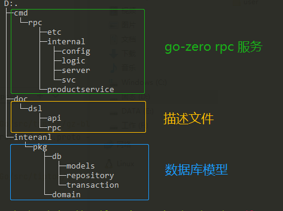
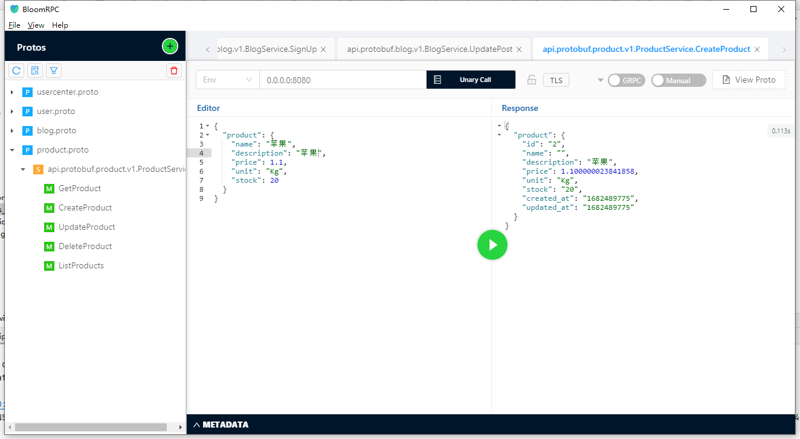
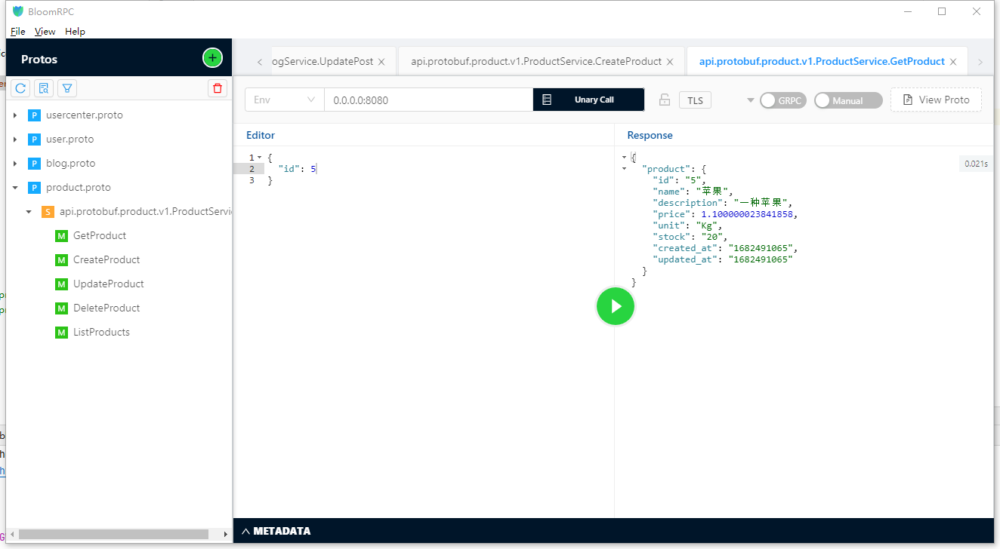

# 商品服务

生成基于 [go-zero](https://github.com/zeromicro/go-zero)+[gorm](https://github.com/go-gorm/gorm)+ddd 的商品服务 demo

## 0.初始化

安装goctl protoc 工具，
生成gorm的模型需要替换goctl,版本分支 `goctl138`
https://github.com/tiptok/go-zero/tree/goctl138


## 1.建表

```
mkdir -p deploy/sql/product
touch touch deploy/sql/product/000001_create_product_table.up.sql
```

sql文件内容如下:

```sql
CREATE TABLE products (
    id INT AUTO_INCREMENT PRIMARY KEY,
    name VARCHAR(255) NOT NULL,
    description TEXT,
    price DECIMAL(10, 2) NOT NULL,
    created_at TIMESTAMP NOT NULL DEFAULT CURRENT_TIMESTAMP,
    updated_at TIMESTAMP NOT NULL DEFAULT CURRENT_TIMESTAMP ON UPDATE CURRENT_TIMESTAMP,
		deleted_at timestamp       null,
    version    bigint       default 0
);
```

```
touch deploy/sql/product/000001_create_product_table.down.sql
```

sql文件内容如下:

```sql
drop table if exists product;
```

生成模型
```
goctl model mysql ddl -s deploy/sql/product/000001_create_product_table.up.sql -d app/product
```

## 2.编写proto文件

```
mkdir -p api/protobuf/product/v1
touch api/protobuf/product/v1/product.proto
```

proto文件如下:
```protobuf
syntax = "proto3";

package api.protobuf.product.v1;

option go_package = "../v1";

message Product {
  int64 id = 1;
  string name = 2;
  string description = 3;
  float price = 4;
  string unit = 5;
  int64 stock = 6;
  int64 created_at = 7;
  int64 updated_at = 8;
}

message CreateProductRequest {
  Product product = 1;
}

message CreateProductResponse {
  Product product = 1;
}

message UpdateProductRequest {
  Product product = 1;
}

message UpdateProductResponse {
  bool success = 1;
}

message GetProductRequest {
  int64 id = 1;
}

message GetProductResponse {
  Product product = 1;
}

message DeleteProductRequest {
  uint64 id = 1;
}

message DeleteProductResponse {
  bool success = 1;
}

message ListProductsRequest {
  int32 offset = 1;
  int32 limit = 2;
}

message ListProductsResponse {
  repeated Product products = 1;
  uint64 count = 2;
}

service ProductService {
  rpc GetProduct(GetProductRequest) returns (GetProductResponse) {}
  rpc CreateProduct(CreateProductRequest) returns (CreateProductResponse) {}
  rpc UpdateProduct(UpdateProductRequest) returns (UpdateProductResponse) {}
  rpc DeleteProduct(DeleteProductRequest) returns (DeleteProductResponse) {}
  rpc ListProducts(ListProductsRequest) returns (ListProductsResponse) {}
}

```

生成服务
```
goctl rpc protoc api/protobuf/product/v1/*.proto --go_out=./api/protobuf/product/v1 --go-grpc_out=./api/protobuf/product/v1 --zrpc_out=app/product/cmd/rpc
```

生成服务代码目录



## 3.填写业务逻辑

- [创建产品服务](../app/product/cmd/rpc/internal/logic/createproductlogic.go)



- [查询产品服务详情](../app/product/cmd/rpc/internal/logic/getproductlogic.go)



## 接口调用工具

- [BloomRpc](https://github.com/bloomrpc/bloomrpc) 应答里面float精度显示不正常(软件问题),grpcui下正常
- [grpcui 需要开启grpc 服务反射功能](https://github.com/fullstorydev/grpcui)

```
go install github.com/fullstorydev/grpcui/cmd/grpcui@latest
grpcui -plaintext localhost:8080
```

- [项目git 源码地址](https://github.com/tiptok/gz-blog-microsevices)